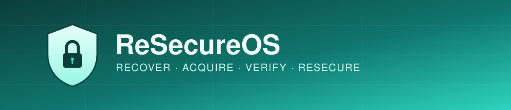
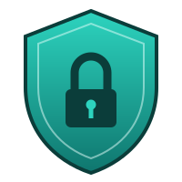
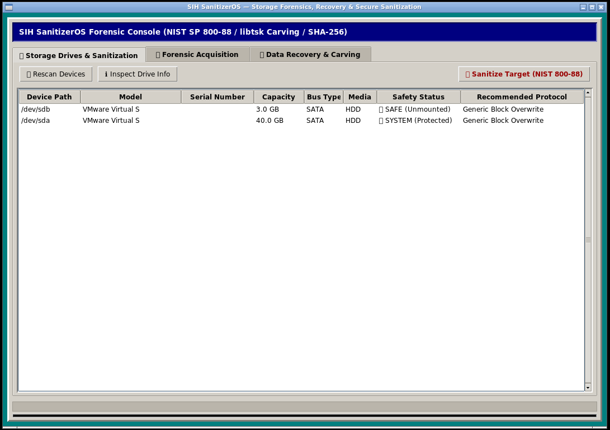
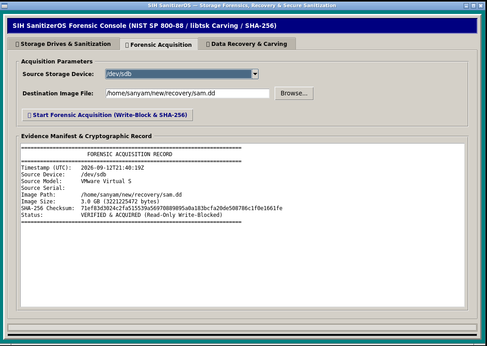
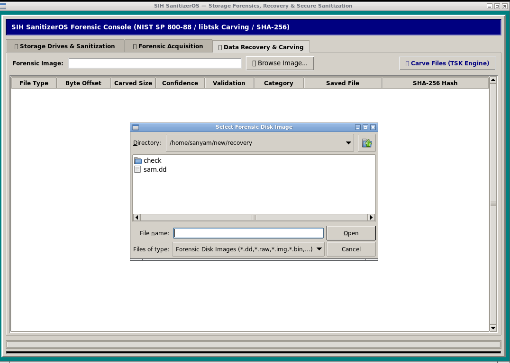
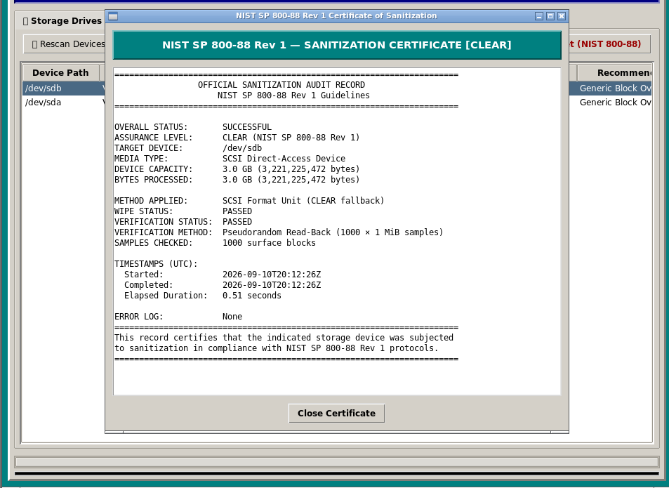

<<<<<<< HEAD
<p align="center">
  
</p>

<h1 align="center">
  
  ReSecureOS
</h1>
=======
````md
<p align="center">
  
</p>

<h1 align="center">ReSecureOS</h1>
>>>>>>> f47e4e42668f3427ee6fe12b4a7f02e1635cafd8

<p align="center">
  <strong>Recover · Acquire · Verify · Resecure</strong>
</p>

<p align="center">
  Open-source Linux platform for digital forensics, data recovery,
  forensic acquisition, and secure storage sanitization.
</p>

<p align="center">


</p>

---

# About

**ReSecureOS** is an open-source Linux-based platform designed for
working with storage devices across the complete forensic lifecycle.

The project combines:

- Storage device discovery
- Device metadata inspection
- Forensic acquisition
- Disk imaging
- SHA-256 evidence hashing
- Deleted-file recovery
- File carving
- File validation
- Confidence scoring
- Recovered-file classification
- Capability-driven storage sanitization
- NVMe sanitization
- ATA sanitization
- SCSI sanitization
- Generic block-level clearing
- Post-operation verification
- Evidence manifests
- Audit information
- Linux graphical workflows

ReSecureOS is built around a modular **C++17 core** with a
**Python/Tkinter interface** connected through **pybind11**.

The long-term goal is to provide a portable Linux environment that can
perform forensic and storage-security operations independently of the
host operating system.

---

# Why ReSecureOS?

Storage devices require different approaches depending on their
hardware, interface, capabilities, and intended operation.

A conventional one-size-fits-all approach is not appropriate for every
storage technology.

ReSecureOS therefore follows a **capability-driven architecture**.

```text
                         Storage Device
                               │
                               ▼
                       Device Discovery
                               │
                               ▼
                       Safety Inspection
                               │
                  ┌────────────┴────────────┐
                  │                         │
                  ▼                         ▼
          Forensic Workflow          Sanitization
                  │                         │
                  ▼                         ▼
          Evidence Acquisition      Capability Probe
                  │                         │
                  ▼                ┌────────┼────────┐
              Disk Image           │        │        │
                  │                ▼        ▼        ▼
                  ▼              NVMe     ATA      SCSI
             SHA-256              │        │        │
                  │                └────────┼────────┘
                  ▼                         │
            File Recovery                   ▼
                  │                   Verification
                  └──────────┬──────────────┘
                             │
                             ▼
                       Audit / Report
<<<<<<< HEAD
=======
````

---

# Core Features

## 🔍 Device Discovery

ReSecureOS discovers block storage devices through Linux system
interfaces and provides a unified representation of each device.

Device information can include:

* Device path
* Vendor
* Model
* Serial number
* Capacity
* Logical sector size
* Physical sector size
* Rotational state
* Bus type
* Media type
* Mount state

Example:

```text
Device      : /dev/sdb
Model       : VMware Virtual Disk
Serial      : -
Capacity    : 3.00 GiB
Bus         : SATA
Media       : HDD
Status      : SAFE
>>>>>>> f47e4e42668f3427ee6fe12b4a7f02e1635cafd8
```

---

<<<<<<< HEAD
# Core Features

## 🔍 Device Discovery

ReSecureOS discovers block storage devices through Linux system
interfaces and provides a unified representation of each device.

Device information can include:

* Device path
* Vendor
* Model
* Serial number
* Capacity
* Logical sector size
* Physical sector size
* Rotational state
* Bus type
* Media type
* Mount state

Example:

```text
Device      : /dev/sdb
Model       : VMware Virtual Disk
Serial      : -
Capacity    : 3.00 GiB
Bus         : SATA
Media       : HDD
Status      : SAFE
```

---

# 💽 Forensic Acquisition

=======
# 💽 Forensic Acquisition

>>>>>>> f47e4e42668f3427ee6fe12b4a7f02e1635cafd8
The acquisition subsystem provides controlled disk imaging for
forensic workflows.

```text
Source Drive
     │
     ▼
Device Inspection
     │
     ▼
Write Protection
     │
     ▼
Disk Imaging
     │
     ▼
SHA-256 Hash
     │
     ▼
Evidence Manifest
     │
     ▼
Forensic Image
```

Acquisition metadata can include:

* Source device
* Device model
* Serial number
* Image destination
* Image size
* SHA-256 hash
* Acquisition status
* Timestamp
* Write-protection state

The intended workflow is to preserve the original evidence and perform
subsequent analysis against the acquired image.

---

# 🧩 Data Recovery

ReSecureOS provides a modular recovery pipeline for analyzing disk
images and identifying potentially recoverable files.

```text
Disk Image
    │
    ▼
File Carving
    │
    ▼
File Validation
    │
    ▼
Confidence Scoring
    │
    ▼
File Classification
    │
    ▼
Recovered Files
```

Recovered candidates can contain:

| Field        | Description                             |
| ------------ | --------------------------------------- |
| File Type    | Detected file format                    |
| Start Offset | Location where the candidate begins     |
| End Offset   | Location where the candidate ends       |
| Size         | Recovered size                          |
| Validation   | Whether the candidate passes validation |
| Confidence   | Recovery confidence level               |
| Category     | Classification such as Images/Documents |
| Output Path  | Recovery destination                    |
| SHA-256      | Hash of the recovered file              |

Example:

```text
Type        : JPEG
Size        : 2.0 KB
Status      : VALID
Confidence  : MEDIUM
Category    : Images
```

---

# 🛡️ Secure Storage Sanitization

ReSecureOS contains a capability-driven sanitization architecture
designed to select an appropriate method based on the storage device.

```text
                         Target Drive
                              │
                              ▼
                        Safety Checks
                              │
                              ▼
                     Capability Detection
                              │
              ┌───────────────┼───────────────┐
              │               │               │
              ▼               ▼               ▼
            NVMe             ATA             SCSI
              │               │               │
              ▼               ▼               ▼
        NVMe Sanitizer   ATA Sanitizer   SCSI Sanitizer
              │               │               │
              └───────────────┼───────────────┘
                              │
                              ▼
                         Verification
                              │
                              ▼
                         Audit Result
```

Supported sanitizer architecture includes:

* NVMe sanitization
* ATA sanitization / secure erase mechanisms
* SCSI sanitization
* Generic block-level clearing

The system should not assume that every device supports the same
sanitization mechanism.

---

# Sanitization Assurance

ReSecureOS distinguishes between different levels of sanitization
assurance.

### CLEAR

A logical sanitization operation such as block-level overwriting.

### PURGE

A stronger device-level sanitization mechanism intended to provide
greater protection against recovery.

ReSecureOS does **not** claim PURGE simply because a command was issued.

The reported result should be based on:

* Device capabilities
* Sanitization method
* Command result
* Verification evidence
* Device-specific behavior

This distinction is important when working with SSDs and other
storage technologies where logical overwriting may not address every
physical storage location.

---

# 🔎 Verification

Verification is implemented as a separate subsystem.

For logical CLEAR operations, the current implementation uses
randomized read-back sampling.

```text
Sanitization
     │
     ▼
Verification
     │
 ┌───┴───┐
 │       │
 ▼       ▼
PASS    FAIL
 │       │
 ▼       ▼
Done    Report
```

The verification layer supports direct I/O where available and can
fall back to buffered reads where required by the environment.

Verification results can include:

* Verification status
* Verification method
* Number of samples checked
* Errors encountered
* Operation duration

---

# 🧾 Sanitization Results & Audit Information

Every sanitization operation produces a structured result rather than
simply returning a success/failure value.

Example:

```text
Device          : /dev/sdb
Bus             : SATA
Media           : SATA HDD
Vendor          : Example Vendor
Model           : Example Drive
Serial          : XXXXX
Capacity        : 3221225472 bytes

Method          : Generic Block Clear
Assurance       : CLEAR

Wipe            : PASS
Verification    : PASS
Samples Checked : 1000

Status          : SUCCESS
```

This result model provides the foundation for future:

* Sanitization certificates
* Audit reports
* Evidence logs
* Compliance-oriented documentation

---

# 🖥️ User Interface

ReSecureOS currently includes a lightweight Linux GUI built with
Python/Tkinter.

The interface is designed around the major workflows:

```text
┌─────────────────────────────────────────┐
│              ReSecureOS                 │
├─────────────────────────────────────────┤
│                                         │
│  Devices                                │
│  Acquisition                            │
│  Recovery                               │
│  Sanitization                           │
│  Verification                           │
│  Reports                                │
│                                         │
└─────────────────────────────────────────┘
```

---

# Screenshots

## Device Management



The device interface provides a centralized view of detected storage
devices and their relevant metadata.

---

## Forensic Acquisition



The acquisition interface provides the workflow for selecting a source
device, configuring an acquisition destination, and performing
forensic imaging.

---

## Data Recovery



The recovery interface provides access to file carving, validation,
confidence scoring, classification, and recovered-file output.

---

## Secure Sanitization



The sanitization interface provides device inspection, safety checks,
method selection, sanitization execution, and result reporting.

---

# Architecture

ReSecureOS is divided into independent modules.

```text
                    ┌──────────────────────┐
                    │      ReSecureOS      │
                    └──────────┬───────────┘
                               │
       ┌───────────────────────┼───────────────────────┐
       │                       │                       │
       ▼                       ▼                       ▼
┌─────────────┐        ┌─────────────┐        ┌─────────────┐
│   Device    │        │ Acquisition │        │   Recovery  │
│   Layer     │        │    Layer    │        │    Layer    │
├─────────────┤        ├─────────────┤        ├─────────────┤
│ Discovery   │        │ Imaging     │        │ Carving     │
│ Metadata    │        │ Hashing     │        │ Validation  │
│ Bus Detect  │        │ Write Prot. │        │ Confidence  │
└──────┬──────┘        └──────┬──────┘        │ Classifier  │
       │                      │               └──────┬──────┘
       └──────────────────────┼──────────────────────┘
                              │
                              ▼
                    ┌─────────────────────┐
                    │   Sanitization      │
                    │      Engine         │
                    ├─────────────────────┤
                    │ Capability Probe    │
                    │ NVMe                │
                    │ ATA                 │
                    │ SCSI                │
                    │ Generic Clear       │
                    └──────────┬──────────┘
                               │
                               ▼
                    ┌─────────────────────┐
                    │    Verification     │
                    └──────────┬──────────┘
                               │
                               ▼
                    ┌─────────────────────┐
                    │   UI / CLI / Audit  │
                    └─────────────────────┘
```

---

# Project Structure

```text
ReSecureOS/
│
├── UI/
│   ├── ui.py
│   └── sanitizer_ui.cpp
│
├── acquisition/
│   ├── AcquisitionManager.cpp
│   ├── AcquisitionManager.h
│   ├── DiskImager.cpp
│   ├── DiskImager.h
│   ├── HashEngine.cpp
│   ├── HashEngine.h
│   ├── WriteProtection.cpp
│   └── WriteProtection.h
│
├── apps/
│   ├── acquisition-test/
│   ├── device-test/
│   ├── recovery-test/
│   └── sanitizer/
│
├── assets/
│   ├── banner/
<<<<<<< HEAD
│   │   └── resecureos-banner.svg
│   ├── logo/
│   │   └── resecureos-logo.svg
=======
│   │   └── resecureos-banner.png
│   ├── logo/
│   │   └── resecureos-logo.png
>>>>>>> f47e4e42668f3427ee6fe12b4a7f02e1635cafd8
│   └── screenshots/
│       ├── acquisition.png
│       ├── devices.png
│       ├── recovery.png
│       └── sanitization.png
│
├── device/
│   ├── DriveInfo.h
│   ├── DriveManager.cpp
│   └── DriveManager.h
│
├── recovery/
│   ├── FileCarver.cpp
│   ├── FileCarver.h
│   ├── FileValidator.cpp
│   ├── FileValidator.h
│   ├── ConfidenceScorer.cpp
│   ├── ConfidenceScorer.h
│   ├── FileClassifier.cpp
│   ├── FileClassifier.h
│   └── RecoveredFile.h
│
├── sanitization/
│   ├── SanitizationEngine.cpp
│   ├── SanitizationEngine.h
│   ├── DeviceCapabilityProbe.cpp
│   ├── DeviceCapabilityProbe.h
│   ├── DeviceCapabilities.h
│   ├── SanitizationResult.h
│   ├── GenericBlockSanitizer.cpp
│   ├── GenericBlockSanitizer.h
│   ├── AtaSanitizer.cpp
│   ├── AtaSanitizer.h
│   ├── NvmeSanitizer.cpp
│   ├── NvmeSanitizer.h
│   ├── ScsiSanitizer.cpp
│   ├── ScsiSanitizer.h
│   ├── Verification.cpp
│   └── Verification.h
│
├── os/
│   └── launcher/
│
├── CMakeLists.txt
├── README.md
├── LICENSE
└── CONTRIBUTING.md
```

---

# Technology Stack

| Technology           | Purpose                             |
| -------------------- | ----------------------------------- |
| **Linux**            | Operating system platform           |
| **C++17**            | Core storage and forensic engine    |
| **CMake**            | Build system                        |
| **Python 3**         | GUI/application layer               |
| **Tkinter**          | Lightweight Linux GUI               |
| **pybind11**         | Python ↔ C++ bridge                 |
| **OpenSSL**          | Cryptographic hashing               |
| **Linux/POSIX APIs** | Raw block-device operations         |
| **NVMe ioctl**       | NVMe device operations              |
| **SCSI SG_IO**       | SCSI/ATA passthrough                |
| **libblkid**         | Block-device/filesystem information |
| **libudev**          | Device discovery                    |
| **The Sleuth Kit**   | Filesystem/forensic functionality   |

---

# Installation

ReSecureOS is currently developed for Linux.

## Debian / Ubuntu

Install the required dependencies:

```bash
sudo apt update

sudo apt install \
    build-essential \
    cmake \
    git \
    python3 \
    python3-dev \
    python3-tk \
    pybind11-dev \
    libssl-dev \
    libblkid-dev \
    libudev-dev \
    pkg-config \
    libtsk-dev
```

For the lightweight graphical environment:

```bash
sudo apt install \
    xorg \
    openbox \
    xterm \
    xinit
```

---

# Build

Clone the repository:

```bash
git clone https://github.com/sanyampat/dataRecoveryAndSanatization.git
cd dataRecoveryAndSanatization
```

Create the build directory:

```bash
mkdir -p build
cd build
```

Configure the project:

```bash
cmake ..
```

Build:

```bash
cmake --build . -j$(nproc)
```

---

# Run

From the repository root:

```bash
PYTHONPATH="$PWD/UI" python3 UI/ui.py
```

---

# Python / C++ Integration

The GUI communicates with the C++ core using `pybind11`.

Test the Python module:

```bash
PYTHONPATH="$PWD/UI" python3 -c \
'import cpp_sanitizer; print("ReSecureOS C++ SANITIZER OK")'
```

Expected output:

```text
ReSecureOS C++ SANITIZER OK
```

---

# Safety

ReSecureOS performs operations directly against storage devices.

Some operations are **destructive and irreversible**.

Before performing sanitization:

```bash
lsblk -o NAME,SIZE,MODEL,SERIAL,TYPE,MOUNTPOINTS
```

Verify:

* Correct device
* Correct model
* Correct serial number
* Correct capacity
* Device is not the system disk
* Partitions are not mounted
* Device is intended for the operation
* Correct sanitization method has been selected

### Never assume a device path is safe.

For example:

```text
/dev/sda
/dev/sdb
/dev/nvme0n1
```

are dynamically assigned by Linux and do not inherently identify a
particular physical drive.

---

# Testing

Storage operations should be tested using:

* Disposable drives
* Virtual disks
* Test images
* Authorized evidence media

A recommended development environment is:

```text
              QEMU / VMware
                    │
                    ▼
           Disposable Virtual Disk
                    │
                    ▼
                ReSecureOS
                    │
                    ▼
                 Testing
```

**Never use your operating-system disk for destructive testing.**

---

# Development Status

## Implemented

* [x] Storage device discovery
* [x] Drive metadata abstraction
* [x] Linux block-device interaction
* [x] C++17 modular architecture
* [x] CMake build system
* [x] Disk imaging
* [x] SHA-256 hashing
* [x] Write-protection abstraction
* [x] File carving
* [x] File validation
* [x] Confidence scoring
* [x] File classification
* [x] Python/Tkinter GUI
* [x] Python/C++ pybind11 bridge
* [x] Capability probing architecture
* [x] Sanitization result model
* [x] Generic block sanitization architecture
* [x] NVMe sanitization architecture
* [x] ATA sanitization architecture
* [x] SCSI sanitization architecture
* [x] Post-operation verification architecture
* [x] System/mounted-device safety guards

## In Progress

* [ ] Hardware-wide sanitization validation
* [ ] Improved ATA passthrough compatibility
* [ ] Improved SCSI capability detection
* [ ] Device-specific verification strategies
* [ ] Stronger system-disk/LVM detection
* [ ] Comprehensive hardware compatibility testing
* [ ] Automated regression tests
* [ ] Sanitization certificates
* [ ] Full forensic audit logging
* [ ] Bootable Live environment
* [ ] Hardware compatibility database
* [ ] Production deployment image

---

# Roadmap

## Phase 1 — Core Platform

* [x] Device discovery
* [x] Device metadata
* [x] Modular architecture
* [x] CMake build
* [x] Linux integration

## Phase 2 — Forensic Acquisition

* [x] Disk imaging
* [x] SHA-256 hashing
* [x] Write-protection abstraction
* [x] Evidence manifest
* [ ] Extended acquisition logging

## Phase 3 — Recovery

* [x] File carving
* [x] File validation
* [x] Confidence scoring
* [x] File classification
* [ ] More file signatures
* [ ] Fragmented-file recovery
* [ ] Advanced filesystem recovery
* [ ] Recovery reporting

## Phase 4 — Sanitization

* [x] Sanitization engine
* [x] Capability detection
* [x] Device-specific sanitizer architecture
* [x] Generic block fallback
* [x] Result/audit structure
* [ ] ATA command hardening
* [ ] NVMe hardware validation
* [ ] SCSI command validation
* [ ] Media-aware verification
* [ ] Sanitization certificates
* [ ] Hardware compatibility testing

## Phase 5 — ReSecureOS Live Environment

* [x] Linux development environment
* [x] GUI
* [ ] Bootable ISO
* [ ] Automatic GUI startup
* [ ] Offline forensic toolkit
* [ ] Evidence/audit storage
* [ ] Automated device classification
* [ ] Hardware compatibility database
* [ ] Production-ready deployment image

---

# Open Source

ReSecureOS is being developed as an open-source project.

The project welcomes contributions from:

* Linux developers
* C++ developers
* Digital forensics researchers
* Cybersecurity professionals
* Storage engineers
* Security researchers
* Students
* Open-source contributors

Potential contribution areas include:

* Storage hardware support
* Filesystem support
* Forensic acquisition
* Recovery algorithms
* File signatures
* NVMe support
* ATA support
* SCSI support
* Verification
* GUI development
* Testing
* Documentation
* Live ISO development

---

# Contributing

Create a feature branch:

```bash
git checkout -b feature/your-feature
```

Make your changes and test them.

Commit:

```bash
git add .
git commit -m "Add: your feature"
```

Push:

```bash
git push origin feature/your-feature
```

Then open a Pull Request.

### Contribution guidelines

* Keep modules separated by responsibility.
* Prefer modern C++ practices.
* Avoid destructive operations in automated tests.
* Use disposable devices for storage testing.
* Document hardware-specific behavior.
* Clearly identify experimental functionality.
* Do not claim sanitization assurance without supporting evidence.
* Add regression tests where appropriate.

---

# Security

If you discover a security vulnerability in ReSecureOS, please avoid
publicly disclosing sensitive vulnerability details until the issue
has been investigated.

A dedicated security policy and responsible disclosure process will be
provided as the project matures.

---

# License

See [`LICENSE`](LICENSE) for the applicable license.

*(Choose and add a `LICENSE` file — e.g. MIT, Apache-2.0, or GPL-3.0 —
before advertising the project as open source.)*

---

# Disclaimer

ReSecureOS is intended for:

* Authorized digital forensics
* Data recovery
* Storage research
* Authorized storage sanitization
* Cybersecurity research
* Educational purposes

Sanitization operations can permanently destroy data.

**Only operate on storage devices that you own or have explicit
authorization to process.**

The developers are not responsible for:

* Data loss
* Hardware damage
* Incorrect device selection
* Misuse of the software
* Unauthorized data processing

---

# Vision

The long-term goal of ReSecureOS is to become a **portable,
offline storage-forensics and security operating system**.

The planned environment will boot independently from a host operating
system and provide an integrated workflow for:

```text
             ┌─────────────────────┐
             │     ReSecureOS       │
             └──────────┬──────────┘
                        │
        ┌───────────────┼───────────────┐
        │               │               │
        ▼               ▼               ▼
     Acquire         Recover        Resecure
        │               │               │
        └───────────────┼───────────────┘
                        │
                        ▼
                    Verify
                        │
                        ▼
                     Report
```

The ultimate objective is a portable Linux environment that combines
forensic acquisition, data recovery, storage sanitization,
verification, and audit capabilities in one platform.

---

<<<<<<< HEAD
<p align="center">
  
</p>

<h3 align="center">Recover. Acquire. Verify. Resecure.</h3>

<p align="center">
  <strong>Digital Forensics · Data Recovery · Evidence Acquisition · Storage Security · Linux</strong>
</p>

<p align="center">
  ⭐ Star the repository if you find the project useful &nbsp;·&nbsp;
  🐛 Report issues &nbsp;·&nbsp;
  💡 Propose improvements &nbsp;·&nbsp;
  🔧 Contribute code &nbsp;·&nbsp;
  📖 Improve the documentation
</p>
=======
# ReSecureOS

### Recover. Acquire. Verify. Resecure.

**Digital Forensics · Data Recovery · Evidence Acquisition · Storage Security · Linux**

⭐ Star the repository if you find the project useful.

🐛 Report issues.

💡 Propose improvements.

🔧 Contribute code.

📖 Improve the documentation.

````

### One thing I strongly recommend

Before you push this README, make your repository look like this:

```text
ReSecureOS/
│
├── assets/
│   ├── banner/
│   │   └── resecureos-banner.png
│   │
│   ├── logo/
│   │   └── resecureos-logo.png
│   │
│   └── screenshots/
│       ├── devices.png
│       ├── acquisition.png
│       ├── recovery.png
│       └── sanitization.png
│
├── acquisition/
├── apps/
├── device/
├── recovery/
├── sanitization/
├── os/
│
├── CMakeLists.txt
├── README.md
├── LICENSE
└── CONTRIBUTING.md
````
>>>>>>> f47e4e42668f3427ee6fe12b4a7f02e1635cafd8
